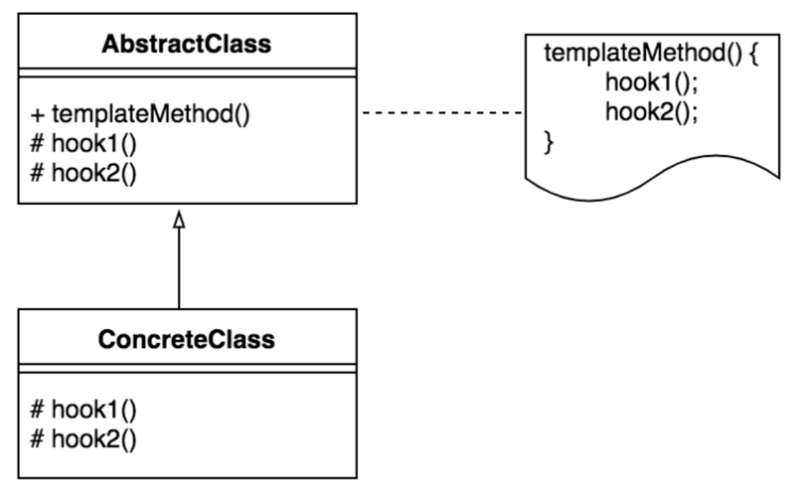

1. 개요
{:toc}

# 프로젝트 관리
[프로젝트 관리 문서](https://docs.google.com/spreadsheets/d/1xxuP3eXVIsYP-Pe4pwDcvYthXhtYNUvVXXgRPU3XWqw/edit?usp=sharing)


# Hook Method
Template Method를 이해하기 위해서는 먼저 Hook Method를 이해해야합니다. 

Hook Method의 개념은 abstract 키워드를 붙이면 상속 받은 클래스는 반드시 해당 메소드를 구현해야 하지만 abstract 키워드를
붙이지 않고 Hook Method로 만들면 반드시 구현할 필요가 없습니다. 상속 받은 클래스에서는 선택적으로 오버라이드 할 수 있습니다.

```java
abstract class Cat{
    abstract public void meow();

    public void sleep()
    {
        System.out.println("Zzz");
    }
}

class BlackCat extends Cat {

    @Override
    public void meow()
    {
        // Me...ow?
    }
}

BlackCat bCat = new BlackCate();
bCat.sleep(); // Zzz
bCat.mewo(); // Me..ow
```

sleep() 메서드는 Cat 클래스에서 구현이 되어있기 때문에 추상클래스를 상속받은 클래스에서 오버라이드할 필요없이 바로 사용하여도 됩니다.

# Template Method Pattern


어떤 작업을 처리하는 일부분을 서브 클래스로 캡슐화해 전체 일을 수행하는 구조는 바꾸지 않으면서 특정 단계에서 수행하는 내역을 바꾸는 패턴입니다.

> 상속을 통해 슈퍼클래스의 기능을 확장할 때 사용하는 가장 대표적인 방법.
> 변하지 않는 기능은 슈퍼클래스에 만들어두고 자주 변경되며 확장할 기능은 서브클래스에서 만들도록 한다.



위에서 보이는 다이어그램은 템플릿 메소드의 구조를 보여줍니다. AbstractClass는 템플릿 메소드를 정의하면서,
하위 클래스에서 확장할 수 있는 메소드인 훅 메소드를 제공합니다. 

템플릿 메서드는 일반 메서드와 훅 메서드를 사용하며 ConcreteClass는 물려받은 훅 메서드를 재정의 합니다.

```java
public class Cat{
    public void bark()
    {
        // meow
    }


    public void walk()
    {
        // 안가. 집이 최고
    }

    public void takeShower()
    {
        // 절대 안해
    }

    public void eatFood()
    {
        // 뇸뇸
    }
}

public class Dog{
    public void barK()
    {
        // Wal
    }

    public void walk()
    {
        // 산책 갈래
    }

    public void takeShower()
    {
        // 하라면 해야지..
    }

    public void eatFood()
    {
        // 와구와구
    }
}
```

위 코드를 보면 동일한 코드가 있는것을 볼 수 있습니다. Animal이라는 클래스를 정의하여 중복된 코드를 제거할 수 있습니다.

```java
public abstract class Animal{
    public abstract void walk();
    public abstract void takeShower();

    public void dayRoutine()
    {
        bark();
        walk();
        takeShower();
        eatFood();
    }

    public void bark()
    {
        // Wal,meow
    }

    public void eatFood()
    {
        // 냠냠, 뇸뇸
    }
}
```

Animal 클래스를 추상 클래스로 선언한 다음 추상화할 메서드를 추상 메서도르 선언합니다. 위의 dayRoutine 함수는
템플릿 메서드 이며 walk,takeshower는 훅 메서드입니다.

```java
public class Cat extends Animal{
    
    @Override
    public void walk()
    {
        // 안가. 집이 최고
    }

    @Override
    public void takeShower()
    {
        // 절대 안해
    }
  
}
```
Cat 클래스는 Animal을 상속받아와 추상 메서드를 재정의합니다.

위 과정으로 템플릿 메서도를 학습할 수 있었습니다. 평소에 쓰기도 하였던 것이지만 구조를 가지게 됨으로써 활용을 좀 더 쉽게 할
수 있게 된것 같습니다. 템플릿 메서드를 이용하면 확장성과 유연성을 가지고 있을수 있음을 다시 상기하면 좋을 것 같습니다.


# Reference

- [heejeong Kwon- [Design Pattern] 템플릿 메서드 패턴이란](https://gmlwjd9405.github.io/2018/07/13/template-method-pattern.html)
- [heejeong Kwon- [Design Pattern] 팩토리 메서드 패턴이란](https://gmlwjd9405.github.io/2018/08/07/factory-method-pattern.html)