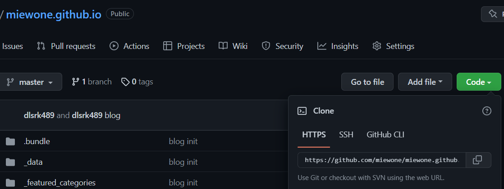

# 깃 블로그 만들기 
## 테마 고르기

[jekyll-theme](https://github.com/topics/jekyll-theme) : 깃 허브 블로그 테마로 유명한 jekyll의 topics 입니다.

[hydejack](https://hydejack.com/blog/) : 지금 보시는 블로그에 적용된 테마입니다.

전 위 테마 중 그냥 hydejack가 더 맘에 들어서 선택을 하였습니다.

## hydejack 설치하기

[hydejack 설치 사이트](https://hydejack.com/download/)로 이동하시면 Free, PRO 버전 두가지가 있습니다. 자신의 용도에 맞는 것중 하나를 
고르시고 다운 받아주시면 됩니다.

저는 Free 버전을 다운받았으니 Free 버전 기준을 설명을 시작하겠습니다.

## Ruby와 Jekyll

hydejack를 이용하기 위해서는 ruby와 컴파일러 jekyll를 설치해야합니다.

### ruby 설치

[Ruby 다운](https://rubyinstaller.org/downloads/) 사이트

[22-06-24,Ruby+Devkit 3.1.2-1 (x64)](https://github.com/oneclick/rubyinstaller2/releases/download/RubyInstaller-3.1.2-1/rubyinstaller-devkit-3.1.2-1-x64.exe) 설치 파일

[22-06-24,Ruby+Devkit 3.1.2-1 (x86)](https://github.com/oneclick/rubyinstaller2/releases/download/RubyInstaller-3.1.2-1/rubyinstaller-devkit-3.1.2-1-x86.exe) 설치 파일

대충 눈치 껏 설치하시면 됩니다.

#### 설치 순서
1. installation 선택
2. 설치 완료 후 엔터 입력
3. 터미널, 커맨드 창을 이용하여 `ruby -v`로 루비 설치 완료 확인.
4. 터미널, 커맨드 창의 위치를 hydejack 소스 압축이 풀린 위치(`~/hydejack`)로 변경
5. `~/hydejack` 에서 아래의 명령어 실행 ( 터미널 닫지 마세요 )
```shell
$ bundle update --bundler
$ bundle install
# exec 명령어를 사용하는 부분에서 build, serve를 자주 이용할 텐데
# build는 소스를 컴파일 하여 깃 허브 및 서버에서 구동하기 하게 파일을 만들어 주는 과정
# serve는 build 후 localhost:4000 으로 서버를 구동시켜 줍니다..
$ bundle exec jekyll build
```
### Git에 업로드하기

github에 들어가서 자신의 닉네임 저의 경우 `miewone`을 포함한 repository의 이름 `miewone.github.io`을 만듭니다.

ex) create repostiory ( name `viwer.github.io` )

그 후 모두가 아시는 방법으로 만들어진 repository에 들어가 **초록색 Code** 눌러 나오는 링크를 복사합니다.



*설치 순서*에서 끄지 않은 터미널에서 밑 명령어를 순서대로 실행합니다.

 주의! 

`_config.yml`파일의 85,86행을 수정 해줘야합니다. 
```text
전                                후
theme: jekyll-theme-hydejack --> # theme: jekyll-theme-hydejack
# remote_theme: hydecorp/hydejack@v9 -->  remote_theme: hydecorp/hydejack@v9
```

```shell
$ git init
$ git remote add origin *복사한 링크*
$ git add .
$ git push origin master
```

이게 `깃허브닉네임.github.io` 에 접속하시면 접속이 되는 걸 볼 수 있습니다. (보이는데 시간이 걸릴 수 있습니다.)

## 수정하기
 VScode, Subtitle, etc. 원하시는 툴을 이용하여 열어 줍니다.


저는 웹스톰을 이용하여 진행할 예정입니다.

주로 수정 하는 문서는 `_config.yml` 파일입니다.

### 초기 수정
```yaml
title:                 miewone Blog # 브라우저 탭 타이틀 

tagline:               모방; 모든것엔 방법이 있다. # 사이드바에 보이는 태그라인

menu:  # 사이드바에 보이는 카테고리 
  - title:             Example
    url:               /example/
  - title:             Documentation
    url:               /docs/
  - title:             Posts
    url:               /posts/
  - title:             About
    url:               /about/
```

### 빌드 후 커밋

수정 완료 후 
`bundle exec jekyll build` 명령어로 빌드 후 git에 푸쉬를 해야 합니다. 그리고 `_config.yml` 파일에 들어가 85,86행을 또 수정해야하는데 저는 이 방법이 귀찮아
스크립트를 이용하여 진행하고 있습니다.

```shell
# git.sh
sed -i "s/# theme: jekyll-theme-hydejack/theme: jekyll-theme-hydejack/g" _config.yml
sed -i "s/remote_theme: hydecorp\/hydejack@v9/#remote_theme: hydecorp\/hydejack@v9/g" _config.yml

bundle exec jekyll build
sed -i "s/theme: jekyll-theme-hydejack/# theme: jekyll-theme-hydejack/g" _config.yml
sed -i "s/#remote_theme: hydecorp\/hydejack@v9/remote_theme: hydecorp\/hydejack@v9/g" _config.yml
git add .
git commit -m "blog update"
git push -u origin master
```