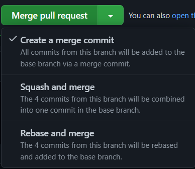

1. 포스팅
{:toc}

# git

## 기능

### commit

#### ament

[atlassian git](https://www.atlassian.com/ko/git/tutorials/rewriting-history)
마지막 커밋 수정하기.
### PR

### autolink
[git doc](https://docs.github.com/en/repositories/managing-your-repositorys-settings-and-features/managing-repository-settings/configuring-autolinks-to-reference-external-resources)

## Git Repository 구성
[우린 Git-flow를 사용하고 있어요](https://techblog.woowahan.com/2553/)
{:.note title="Reference"}

현재 Gir Repository 구성은 아래 세 부분으로 구성됩니다.
- Upstream Remote Repository
  - 개발자들이 공유하는 저장소, 최신 소스코드가 저장되어 있는 원격 저장소
- Origin Remote Repository
  - Upstream Repository를 Fork한 원격 개인 저장소
- Local Repository
  - 내 컴퓨터에 저장되어 있는 개인 저장소

위 그림은 Git Repository 구성과 워크플로우를 설명하고 있습니다. 작업 내용은 다음과 같습니다.

1. Local Repositoyr에서 작업을 완료 한 후 작업 브랜치를 Origin Repository에 push 합니다.
2. Github에서 Origin Repository에 push한 브랜치를 Upstream Repository로 merge하는 Pull Request를 생성하고 코드리뷰를 거친 후 merge합니다.
3. 새로운 작업을 할 때 Local Repository에서 Upstrea Repository를 pull 합니다.

## 깃 브랜치 전략 세우기

### 브랜치 전략을 세우는 이유와 요령

* 하나의 프로젝트 소스코드를 여러 개발자가 다루면서 발생하는 각종 부작용을 해결하기 위해
* 개발 협업을 원활하게 하기 위한 약속
* 전략을 세울 때 고려할 수 있는 요소로 구분할 수 있다.

### git-flow
master, develop, feature, release, hotfix 브랜치를 설정하고 운영하는 방식
{:.note title="요약""}

git-flow는 5 가지의 브랜치가 존재합니다. 항상 유지되는 main 브랜치들(`master`,`develop`)과 일정 기간 동앙만 유지 되는 보조 브랜치들(feature, release, hotfix)가 존재합니다.

- master : 제품으로 출시될 수 있는 브랜치
- develop : 다음 출시 버전을 개발하는 브랜치
- feature : 기능을 개발하는 브랜치
- release : 이번 출시 버전을 준비하는 브랜치
- hotfix : 출시 버전에서 발생한 버그를 수정 하는 브랜치

처음에는 `master`와 `develop` 브랜치가 존재합니다. (`develop` 브랜치는 `master`에서 시작된 브랜치)
`develop` 브랜치에서는 상시로 버그를 수정한 커밋들이 추가됩니다.

새로운 기능 추가 작업이 있는 경우 `develop` 브랜치에서 `feature` 브랜치를 생성합니다. (`feature` 브랜치는 언제나 `develop` 브랜치에서부터 시작합니다.)
기능 추가 작업이 완료 되었다면 `feature` 브랜치는 `develop`브랜치로 merge 됩니다.

`develop`에 이번 버전이 포함되는 모든 기능이 merge 되었다면 QA 하기 위해 `develop` 브랜치에서부터 `release` 브랜치를 생성합니다. QA를 진행하면서 발생한 버그들은 `release` 브랜치에 수정됩니다.

QA를 무사히 통과 했다면 `release` 브랜치를 `master`와 `develop` 브랜치로 merge 합니다. 마지막으로 출시된 `master` 브랜치에서 버전 태그를 추가합니다.

### github flow
main(master), feature 브랜치만으로 운영하는 방식
{:.note title="요약""}

[Git flow, GitHub flow, GitLab flow](https://ujuc.github.io/2015/12/16/git-flow-github-flow-gitlab-flow/)
{:.note title="Reference"}

#### 특징
- `release` 브런치가 명확하지 않은 시스템에서 사용에 맞게 되어있습니다.
- `hotfix`와 가장 작은 기능을 구분하지 않습니다.

#### 사용 시점

1. `master` 브랜치는 어떤 때든 배포가 가능합니다.
  - master 브런치는 항상 최신의 상태이며, stable 상태로 Product에 배포되는 브런치입니다. 그리고 이 브런치에 대해서는 엄격한 role를 주어 사용합니다.
2. 새로운 일을 시작하기 위해 브랜치를 `master`에서 딴다면 이름은 어떤 일을 하는지 명확하게 작성해야합니다.
  - git flow 와는 다르게 feature 브런치나 develop 브런치가 존재하지 않습니다.
3. 원격지 브런치로 수시로 push
  - git flow 와 가장 상반되는 방식입니다. 항상 원격지에 자신이 하고 있는 일들을 올려 다른 사람들도 확인할 수 있도록 해줍니다.
4. 피듭개이나 도움이 필요할 때, 그리고 merge 준비가 완료 되었을 때는 PR을 생성합니다.
5. 기느에 대한 리뷰가 끝난 후 `master`로 merge 합니다.
6. `master`로 머지되고 푸시되었을 때는 즉시 배포 되어야 합니다.